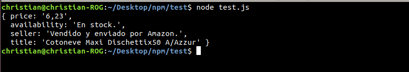
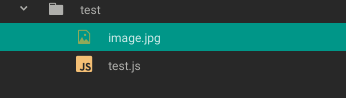

# scraper_amazone

find information about product by link, like: price, availability, seller, title.

## Installation:

```bash
npm install --save scraper_amazon
```

### Usage async/await:

```js
const scraper_amazon = require('scraper_amazon');

const url = 'https://www.amazon.es/Cotoneve-Maxi-Dischettix50-A-Azzur/dp/B01M8KKDBH/ref=sr_1_1?ie=UTF8&qid=1541087266&sr=8-1&keywords=B01M8KKDBH'
const currency = 'EUR';

await scraper_amazon(url, currency);
```

### Usage simple Promise:
```js
const scraper_amazon = require('scraper_amazon');

const url = 'https://www.amazon.es/Cotoneve-Maxi-Dischettix50-A-Azzur/dp/B01M8KKDBH/ref=sr_1_1?ie=UTF8&qid=1541087266&sr=8-1&keywords=B01M8KKDBH'
const currency = 'EUR';

await scraper_amazon(url, currency).then((data)=>{
  // ...
}).catch((err)=>{
  // ...
});
```
#### Result:



##### Debug Usage:

```js
const scraper_amazon = require('scraper_amazon');

const url = 'https://www.amazon.es/Cotoneve-Maxi-Dischettix50-A-Azzur/dp/B01M8KKDBH/ref=sr_1_1?ie=UTF8&qid=1541087266&sr=8-1&keywords=B01M8KKDBH'
const currency = 'EUR';

await scraper_amazon(url, currency, true)

```
###### Result whith Debug Usage:

Screenshot of web page:


